# Alur Kerja SIDONA

Dokumen ini memetakan alur kerja tiap fitur SIDONA dalam bentuk diagram. Untuk cara instalasi, akun demo, dan peta halaman, lihat [`PANDUAN_PENGGUNAAN.md`](PANDUAN_PENGGUNAAN.md).

Diagram memakai format Mermaid, otomatis tampil sebagai gambar di GitHub dan kebanyakan pratinjau markdown.

Satu catatan penting sebelum membaca: **pembayaran donasi saat ini masih simulasi** (tidak ada uang yang berpindah). Titik penyambung ke gateway sungguhan (Midtrans atau Xendit) sudah disiapkan di `DonationPayment::confirm()`, jadi alurnya sama persis ketika gateway dipasang nanti.

---

## 1. Peta Alur Keseluruhan Sistem

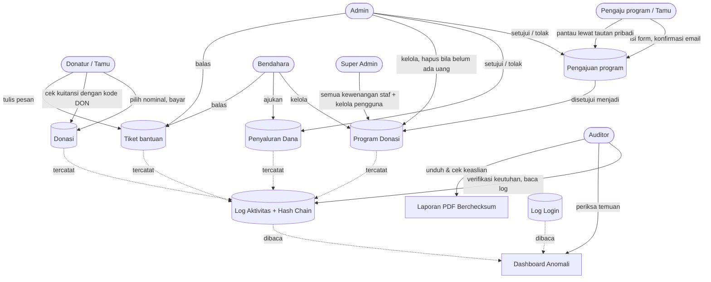

---

## 2. Alur Donasi (tanpa verifikasi manual)

Donasi sah **otomatis** begitu pembayaran terkonfirmasi. Tidak ada upload bukti transfer dan tidak ada antrean verifikasi oleh staf.

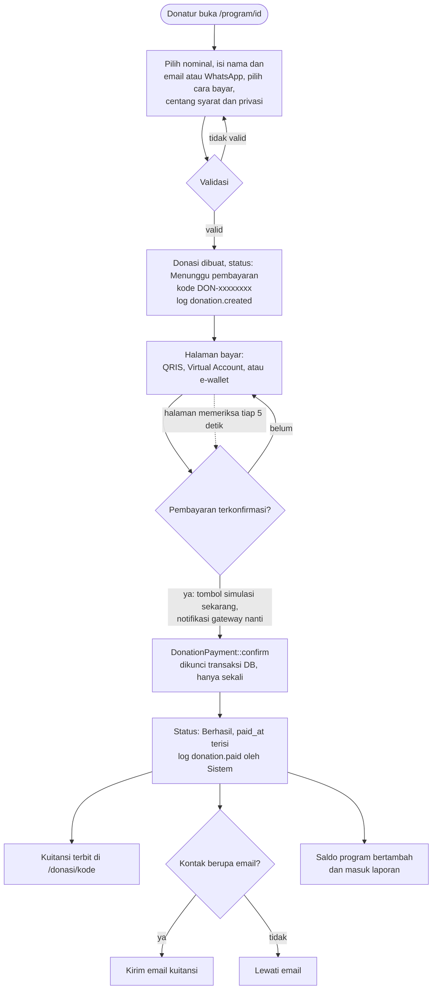

Catatan: donatur yang memilih anonim tampil sebagai "Hamba Allah" di halaman publik. Nama aslinya tetap tersimpan dan hanya terlihat staf.

---

## 3. Alur Pengajuan Program oleh Tamu

Tanpa akun dan tanpa kata sandi. Identitas pengaju dibuktikan lewat konfirmasi email, dan pemantauan lewat tautan pribadi.

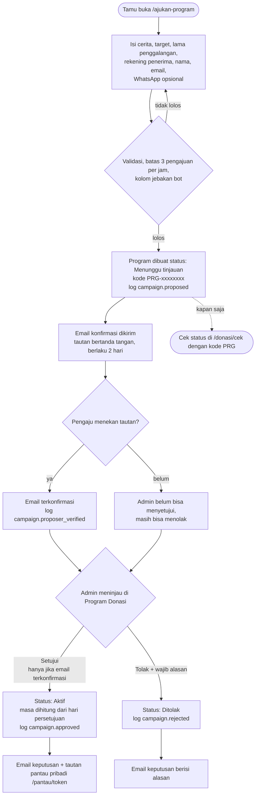

Halaman pantau (`/pantau/token`) bersifat baca saja: dana terkumpul, jumlah donatur, donasi terbaru, penyaluran yang disetujui, dan saldo. Mengubah teks, foto, atau masa program dilakukan lewat admin.

---

## 4. Alur Pengajuan dan Persetujuan Penyaluran Dana

Prinsip pemisahan tugas (maker-checker): yang mengajukan tidak boleh menyetujui.

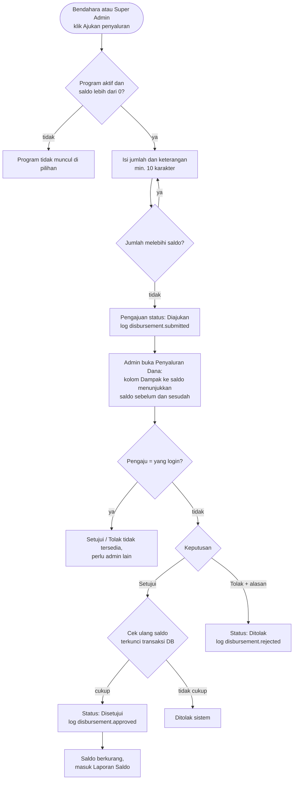

Aturan ini berlaku untuk **semua** peran, termasuk Super Admin: tidak ada yang bisa menyetujui pengajuannya sendiri.

---

## 5. Alur Tiket Bantuan

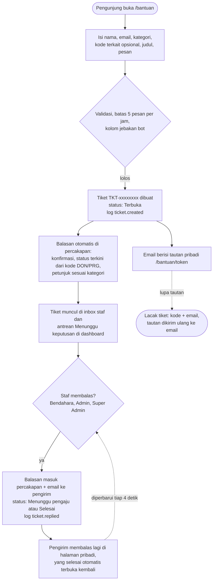

Auditor hanya bisa membaca tiket. Percakapan di sisi staf dan pengunjung diperbarui otomatis tiap beberapa detik (polling), bukan koneksi langsung.

---

## 6. Alur Login dan Pencatatan Login Log

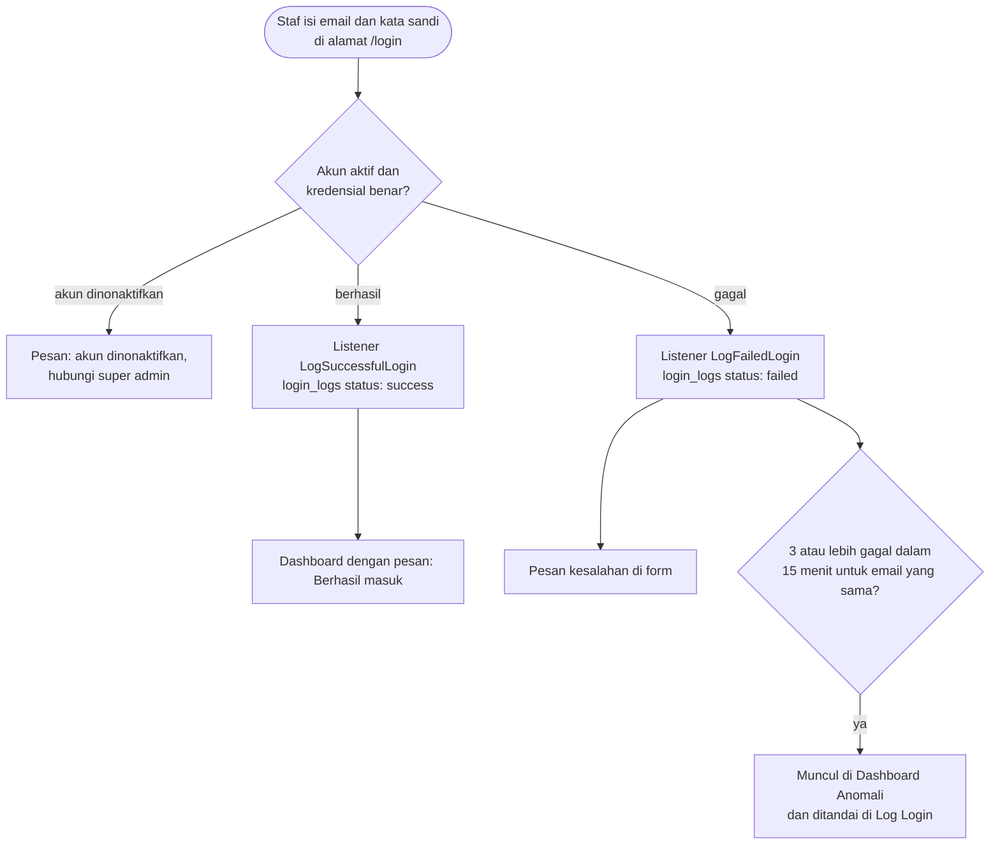

Tautan login staf sengaja **tidak** ditampilkan di situs publik; staf mengakses `/login` langsung. Akun yang dinonaktifkan super admin tidak bisa masuk, dan sesi yang sedang berjalan ikut diakhiri pada permintaan berikutnya.

---

## 7. Alur Activity Log dengan Hash Chain

Fitur pembeda utama SIDONA: setiap aksi penting terikat secara kriptografis ke aksi sebelumnya, sehingga manipulasi data lama bisa dideteksi.

### 7.1 Pencatatan (otomatis di setiap aksi tulis)

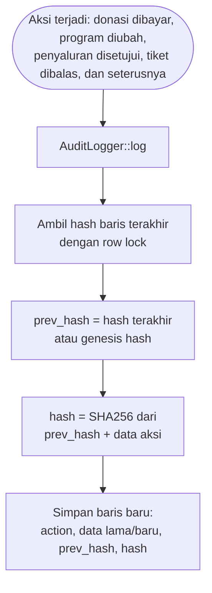

Di homepage publik hanya jenis kejadian, waktu, dan sidik hash singkat yang ditampilkan (tanpa nama, kontak, atau nominal).

### 7.2 Verifikasi Integritas (`/audit/integritas`)

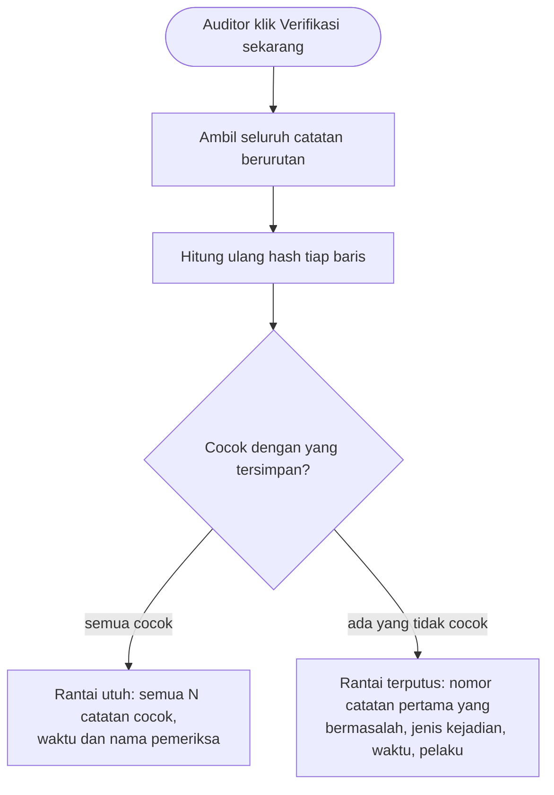

### 7.3 Skenario Demo Manipulasi Data

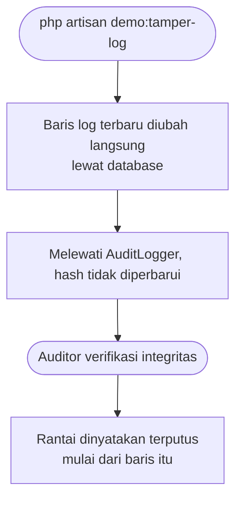

---

## 8. Alur Deteksi Anomali dan Pemeriksaan Temuan

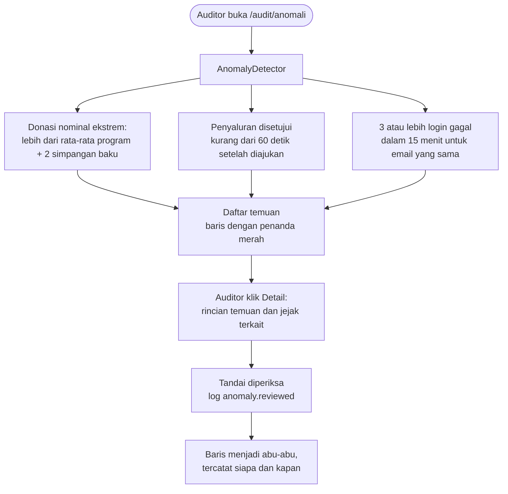

---

## 9. Alur Laporan dan Verifikasi Checksum

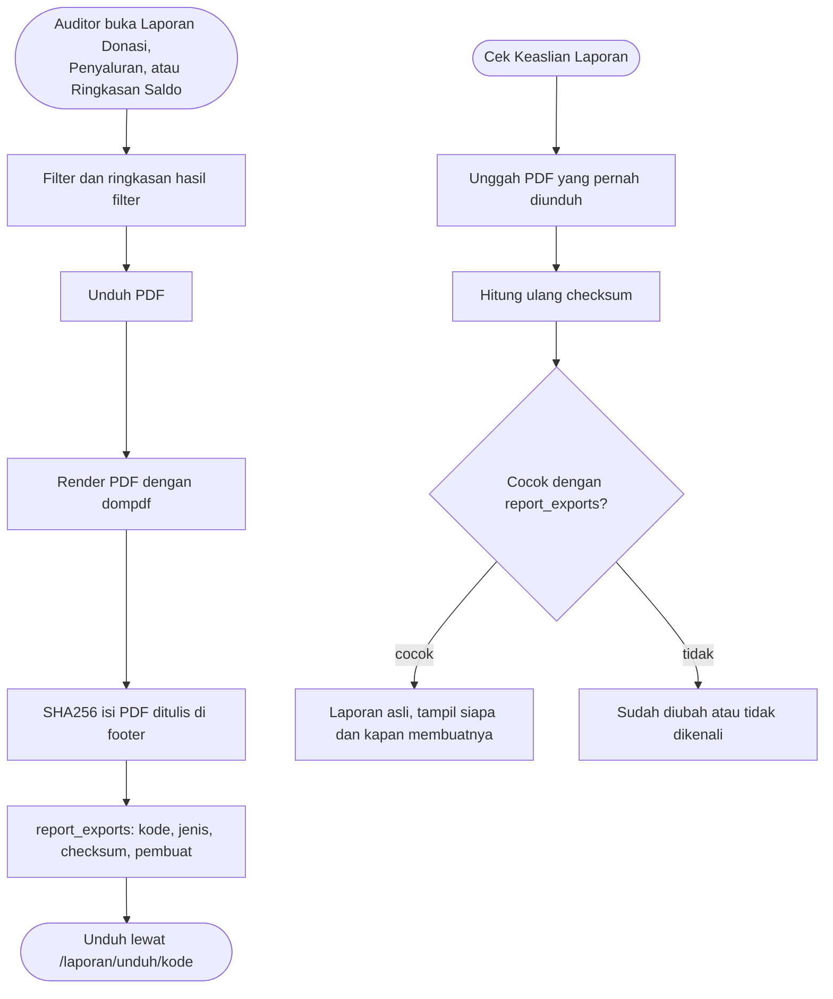

---

## 10. Peta Hak Akses Ringkas

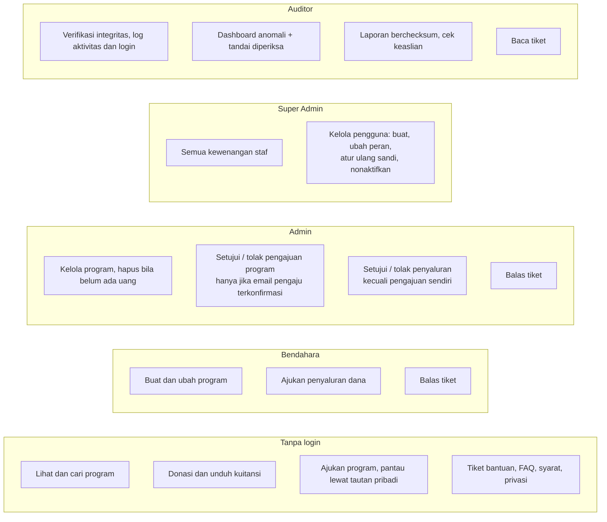
