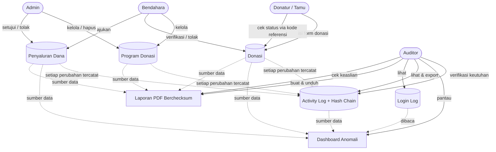
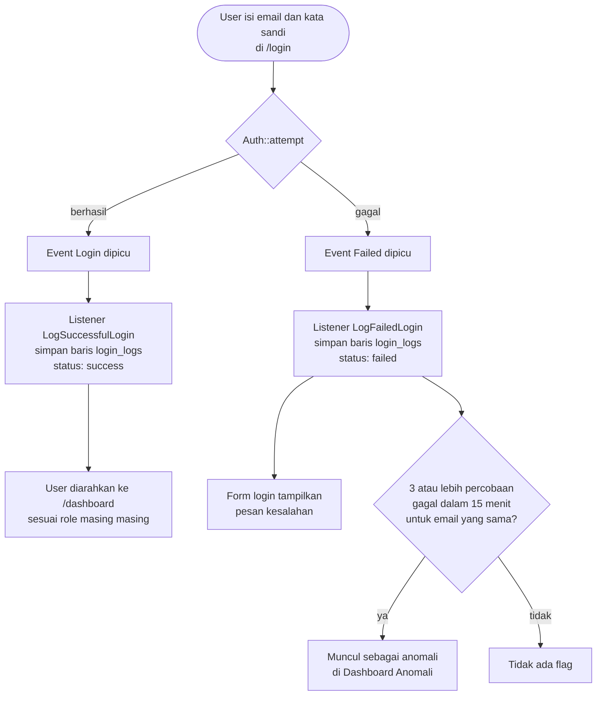
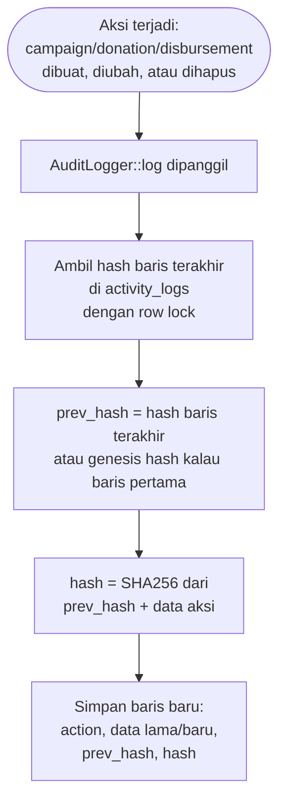
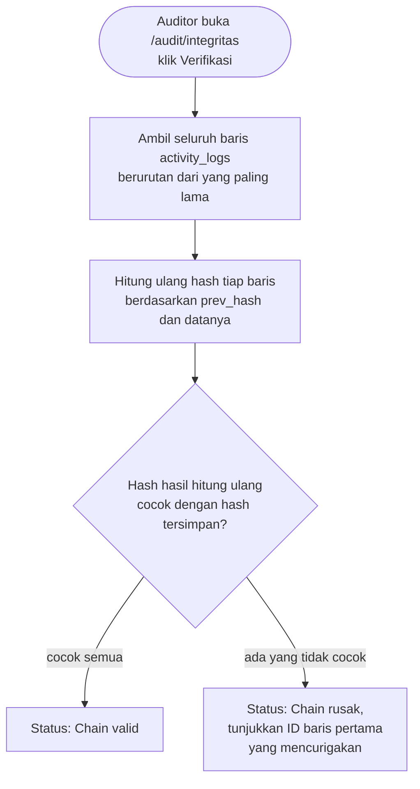
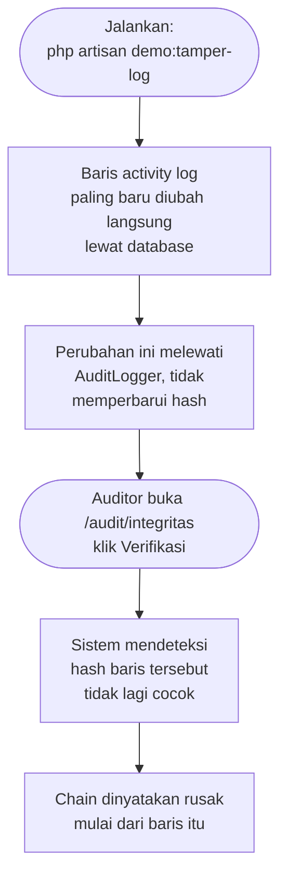
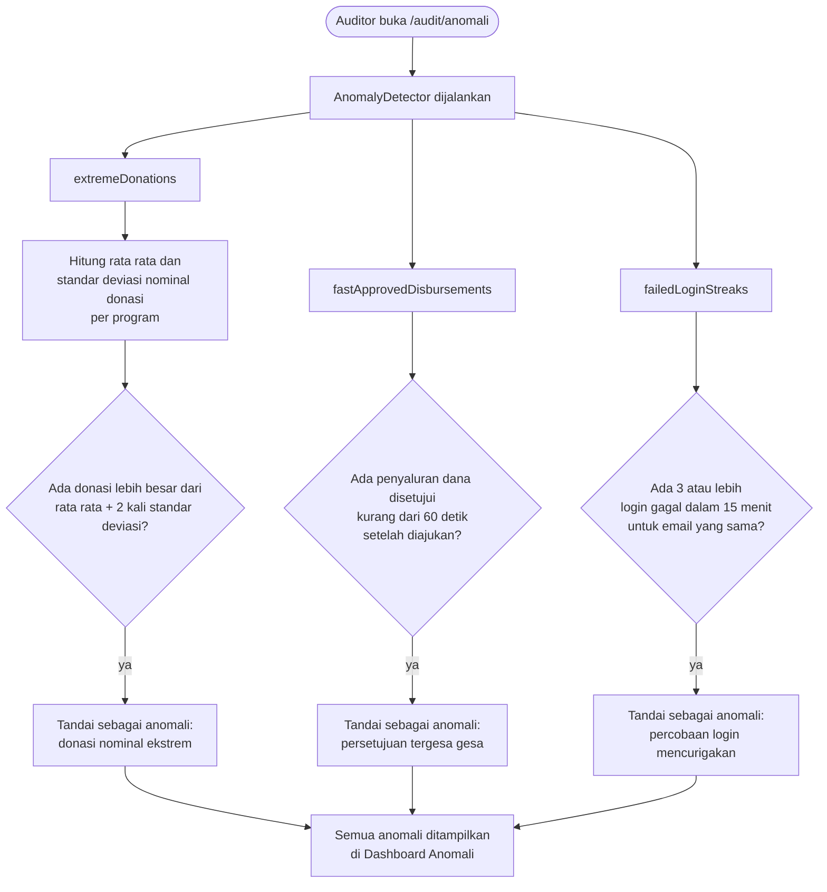
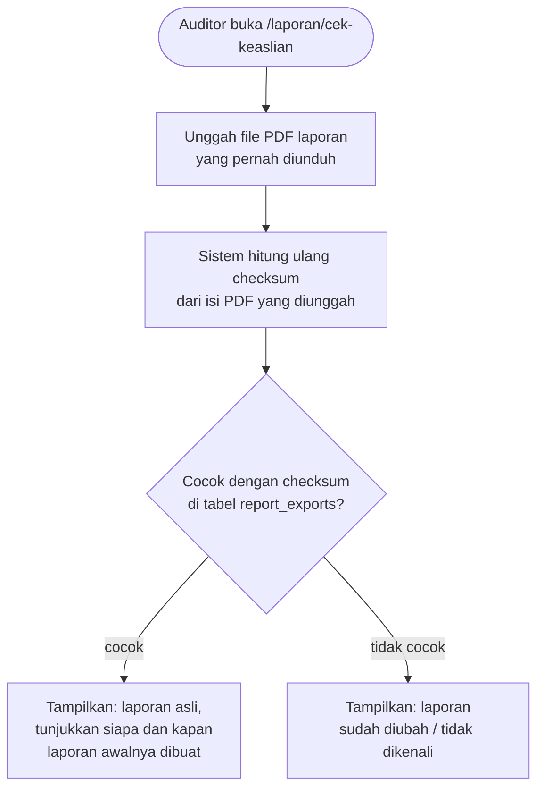
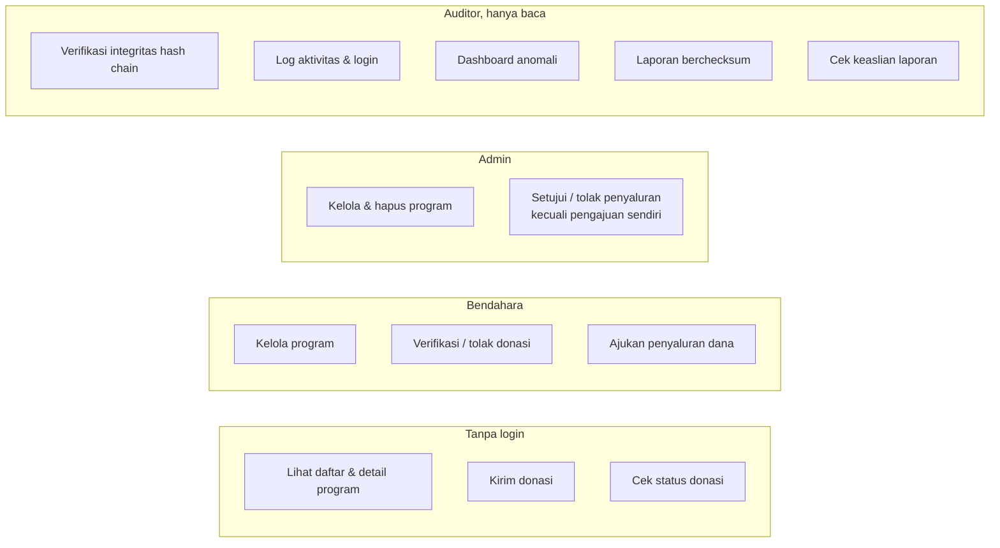

# Alur Kerja SIDONA

Dokumen ini memetakan alur kerja (workflow) tiap fitur yang ada di SIDONA dalam bentuk diagram. Untuk penjelasan cara instalasi, akun demo, dan peta halaman, lihat [`PANDUAN_PENGGUNAAN.md`](PANDUAN_PENGGUNAAN.md).

Diagram memakai format Mermaid, otomatis tampil sebagai gambar di GitHub dan kebanyakan pratinjau markdown.

---

## 1. Peta Alur Keseluruhan Sistem

Gambaran bagaimana keempat jenis pengguna berinteraksi dengan bagian bagian utama sistem.



---

## 2. Alur Donasi

Dari donatur mengisi form sampai donasi diverifikasi atau ditolak Bendahara.

```mermaid
flowchart TD
    A([Donatur buka /program/{id}]) --> B[Isi form donasi:\nnama, kontak, nominal,\nwaktu transfer, bukti transfer]
    B --> C{Validasi input}
    C -->|nominal tidak valid\natau bukti transfer kosong| B
    C -->|valid| D[Sistem simpan donasi\nstatus: Menunggu\n+ buat kode referensi unik]
    D --> E[Donatur menerima kode referensi]
    E --> F([Donatur bisa cek status\nkapan saja di /donasi/cek])

    D --> G[Bendahara buka /donasi]
    G --> H{Bendahara tinjau\nbukti transfer}
    H -->|setuju| I[Klik Verifikasi]
    H -->|tidak sesuai| J[Klik Tolak\n+ wajib isi alasan]

    I --> K[Status donasi: Terverifikasi\ntercatat verified_by dan verified_at]
    J --> L[Status donasi: Ditolak\ntercatat rejection_reason]

    K --> M[AuditLogger mencatat\naksi donation.verified]
    J --> N[AuditLogger mencatat\naksi donation.rejected]

    K --> O{Kontak donatur\nberupa email valid?}
    O -->|ya| P[Kirim email pemberitahuan\ndonasi terverifikasi]
    O -->|tidak| Q[Lewati pengiriman email]

    K --> R[Saldo program bertambah,\nikut dihitung di Laporan Saldo]
```

Catatan aturan: hanya donasi berstatus Menunggu yang bisa diverifikasi atau ditolak, dan hanya Bendahara yang berwenang melakukannya (`DonationPolicy`).

---

## 3. Alur Pengajuan dan Persetujuan Penyaluran Dana

Ini menerapkan prinsip pemisahan tugas (maker checker): yang mengajukan tidak boleh menjadi yang menyetujui.

```mermaid
flowchart TD
    A([Bendahara buka\n/campaigns/{id}/penyaluran/ajukan]) --> B{Program aktif dan\nsaldo tersedia lebih dari 0?}
    B -->|tidak| C[Form ditolak sistem]
    B -->|ya| D[Isi jumlah dan\nketerangan penggunaan dana]
    D --> E{Jumlah melebihi\nsaldo tersedia?}
    E -->|ya| D
    E -->|tidak| F[Simpan pengajuan\nstatus: Diajukan\nsubmitted_by = Bendahara]

    F --> G[AuditLogger mencatat\naksi disbursement.created]
    F --> H[Admin buka /penyaluran]
    H --> I{Admin yang login\n= pengaju pengajuan ini?}
    I -->|ya| J[Tombol setujui/tolak\ntidak tersedia untuk pengajuan ini]
    I -->|tidak| K{Admin setujui\natau tolak?}

    K -->|Setujui| L{Cek ulang saldo program\nsaat ini, terkunci transaksi DB}
    L -->|saldo cukup| M[Status: Disetujui\nreviewed_by, reviewed_at tercatat]
    L -->|saldo sudah tidak cukup\nkarena pengajuan lain| N[Persetujuan ditolak sistem]

    K -->|Tolak| O[Status: Ditolak\nwajib isi alasan]

    M --> P[AuditLogger mencatat\naksi disbursement.approved]
    O --> Q[AuditLogger mencatat\naksi disbursement.rejected]

    M --> R[Saldo program berkurang,\nikut dihitung di Laporan Saldo]
```

Catatan aturan: `DisbursementPolicy` menolak persetujuan/penolakan kalau pengaju dan penyetuju adalah user yang sama, dan pengecekan saldo diulang dengan row lock saat persetujuan diproses supaya dua pengajuan yang diproses bersamaan tidak membuat saldo minus.

---

## 4. Alur Login dan Pencatatan Login Log



---

## 5. Alur Activity Log dengan Hash Chain

Ini fitur pembeda utama SIDONA: setiap aksi penting terikat secara kriptografis ke aksi sebelumnya, sehingga manipulasi data lama bisa dideteksi.

### 5.1 Pencatatan (terjadi otomatis di setiap aksi tulis)



### 5.2 Verifikasi Integritas (halaman Auditor `/audit/integritas`)



### 5.3 Skenario Demo Manipulasi Data



---

## 6. Alur Deteksi Anomali



---

## 7. Alur Laporan dan Verifikasi Checksum

### 7.1 Membuat dan Mengunduh Laporan

```mermaid
flowchart TD
    A([Auditor buka salah satu:\n/laporan/donasi, /laporan/penyaluran,\natau /laporan/saldo]) --> B[Sistem susun data laporan\ndari database]
    B --> C[Render ke PDF pakai dompdf]
    C --> D[ReportChecksum hitung\nSHA256 dari isi PDF]
    D --> E[Checksum ditulis\nke footer PDF]
    E --> F[Simpan record di report_exports:\nkode referensi, jenis laporan,\nchecksum, siapa yang membuat]
    F --> G[File PDF disimpan\ndi disk privat]
    G --> H([Auditor unduh lewat\n/laporan/unduh/{kode referensi}])
```

### 7.2 Cek Keaslian Laporan



---

## 8. Peta Hak Akses Ringkas


